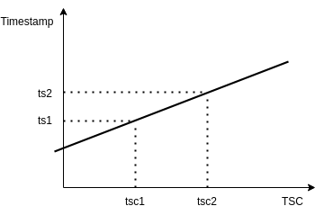

## Very low-impact tracing
#### of high-performance
#### C++ application


_Maciej Gajewski, October 2021_

Note:

I'm really sorry for the long title :)

====

#### About me

Maciek Gajewski 

[maciej.gajewski0@gmail.com](mailto:maciej.gajewski0@gmail.com)


Note:

* 35 years of programming, 25 years of C++
* 2000-2010 Wrocław (Pruftechnik, Tieto)
* 2010-2018 London, Amsterdam, 
* HFT, teaching (Tibra, Optiver)

====

<!-- .slide: data-background-iframe="https://auros.global/" -->

Note:

* Currently with a Hong Kong - based Crypto trading firm.
* End-to-end trading system
* Majority of the code in Python, but the fast bits in C++
* This presentation is about data solving actual production problem

====

## The problem


Note:

* This is the main loop of the application
* In each loop cycle a number of work items is executed
* Sometimes these are timer or socket events,
  but mostly work items reading data from an SHM object and processing it.
* At the end of every cycle we measure the duration and collect some statistics.

====

## The problem


Note:

* After each loop we measure the duration (we call it the "busy time")
* The duration mostly depends on the number of configured inputs
* For this particular application the median duration was around 400us
* This means that the latency introduced was up to 400us, 200us on average
* This was chosen as an acceptable value
* But sometimes the loop duration spiked to few ms, and this is not acceptable!
* The spike could happen several times per second.

====

## Searching for solution

* Sampling profiles are useless
* I was unable to find existing tracing tool that would work
* LTTng, frysk, minitrace, easy_profiler
* Estimated 1 probe per microsecond!

Note:

* Sampling profiles are worthless for inspecting a rare case
* Tracing would be cool, to catch such a long cycle, and see what actually happened
* Existing tracers take a lot of time and are too invasive.
* Maybe there exist a tool that would be useful, but I could't find one!

====

### Requirements

* Absolutely minimal impact on running application
* Should allow for running application in conditions similar to the one in production, 
* for a prolonged period of time

Note:

The design principles of the tracing system:

* The impact on the application must be minimal,
* As the application takes some time to start up, it should allow for arbitrary long runs
* So no fixed-size storage!

====

### High level design


Note:

* The app should collect raw events with absolutely minimal overhead
* Any processing needed should go to the postprocessor
* Finally, the data has to be visualized and explored

====

### Operation


Note:

The idea is to:
* collect events continuously
* evaluate each loop cycle, and if max busy time exceeded - store
* otherwise discard
* The data has to be processed off line, or otherwise outside of the app, to not affect the operation

====

### Tracing event

```cpp
enum class EventType : uint64_t { Enter, Exit, ClockSync };

struct Event {
    EventType type; // type of event
    uint64_t addr;  // code location address
    uint64_t tsc;   // timestamp from the TSC register
};

```

Note:

* The event has to be small, fixed-size record, easy and fast to store.
* The event record is trivial, neither constructor nor destructor.
* The event type can be a simple enum (using 8 bytes, as they would be used by the
padding anyway, and maybe they will be useful)
* To identify the function, a code address is used. It has fixed size and is cheap to get. The function name can be obtained form it using DWARF debug info
* Time comes from the TSC register. This is the fastest way

====

### Event buffer

```cpp
thread_local Event* bufferBegin = nullptr;
thread_local Event* bufferEnd   = nullptr;
thread_local Event* dropPoint   = nullptr;

void initTracing(size_t numEvents) {
  bufferBegin = new Event[numEvents];
  bufferEnd   = bufferBegin + numEvents;
  dropPoint   = bufferBegin;
}
```

Note:

* The event buffer is like a vector - with fixed capacity and a end-of-data pointer
* The event collection is per-thread. If more than one thread is used, it has to be initialized in each thread separately.

====

### TSC vs wall clock



ts = _a_*tsc + _b_

Note:

* TSC is a CPU register counting clock cycles
* The freq varies with the clock, on mobile, power-saving devices
* Even on server boxes with fixed cycles in flows
* Need to be recalculated frequently

====

### The clock sync event

```cpp
inline void addClockSyncEvent(uint64_t now) {
  *(dropPoint++) 
    = Event{EventType::ClockSync, __rdtsc(), now};
}
```

Note:

* Clock sync event simply associates wall-clock time with TSC time
* ie provides data points for identifying the clock (linear regression)
* Note: no boundary checking!

====

### The tracing instrumentation

```cpp

void someFunctionIWantToTrace() {

  TRACE();

  the->actual(code); // goes here
}
```

Note:

The tracing instrumentation is achieved by adding a simple macro at the very beginning
for each function I'm interested in tracing.
It is important that it is clear, visible, but doesn't obfuscate the actual code.

====

### Probe implementation

```cpp

#ifdef TRACING_ENABLED

#define TRACE() \
  _trace_addr: \
  _Tracer _tracer(&&_trace_addr)

#else

#define TRACE() do {} while (false)

#endif
```

Note:

* If TRACING_ENABLED macro is not defined, the TRACE() probe is nothing.
* Otherwise it consists of two elements: a label and a local variable.
* The local variable will inject probe in it's constructor and destructor,
thus when entering and exiting the function
* The "&&" is a gcc extension (supported by clang) that resolves to the address of
the label. It could also be achieved by anm inline assembly, but this is isn't portable either, and is even uglier.

====

### The tracer

```cpp
#include "x86intrin.h"
struct _Tracer {
  _Tracer(void *addr) : mAddr(addr) {
    assert(dropPoint < bufferEnd);
    *(dropPoint++) = 
      {EventType::Enter, __rdtsc(), uint64_t(mAddr)};
  }
  ~_Tracer() {
    assert(dropPoint < bufferEnd);
    asm volatile("" : : : "memory"); // compiler barrier
    *(dropPoint++)
      = {EventType::Exit, __rdtsc(), uint64_t(mAddr)};
  }
  void *mAddr;
};
```

Note:

* It is crucial that the constructor and destructor are in-lined
* The assert is only active in debug build; there is no boundary check in prod build!
* The compiler barrier helps a bit with instruction reordering. Still, compiler sometimes re-orders some non-memory accessing instructions (ie arithmetics on registers) past the destructor. But this is acceptable.
* Both functions resolve to 9-10 assembly instructions, and my estimate (based on measurements!) is that they take 2-3ns.
* The member variable disappears, is optimized away

====

<!-- .slide: data-background-image="img/farquaad.jpeg" -->

Note:

* if program crashes, we need to increase the limit and run it again, no biggie

====

### Store on discard

```cpp
void TraceData::onCycle(busyTime, now) {
  if (dropPoint >= bufferEnd) {
    fmt::print("Trace buffer overrun!\n");
    abort();
  }

  if (busyTime < mThreshold || mSkipThisCycle) {
    dropPoint = bufferBegin;
    addClockSyncEvent(now);
    mSkipThisCycle = false;
  } else {
    addClockSyncEvent(now);
    storeData();
  }
}
```

Note:

* On every loop cycle, after measuring the busy time, we see if it was interesting for us
* The only place when I check for buffer overrun, to die with some dignity

====

### Store on discard

```cpp
void TraceData::storeData() {
  writeToStorage(bufferBegin, dropPoint);
  dropPoint = bufferBegin;
  mSkipThisCycle = true;
}
```

Note:

* When writing to storage, adding a clock event at the end,
* so that the clock may be synced
